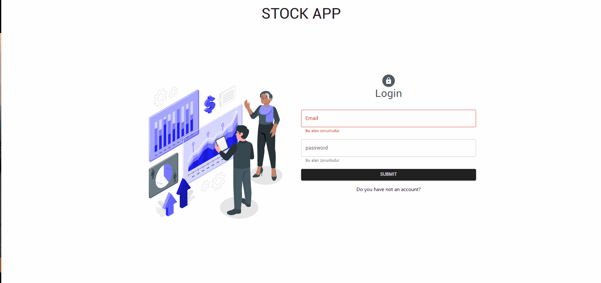

# Welcome to Stock App :wave:

## Description
Thanks to visit my Github! In this project, i used React-Context. This project is created with ReactJS, Redux, Redux Toolkit, Redux Persist, Axios, Material UI, Formik, Yup, Toastify, Emotion/react, Tremor/react Here is the website link for this project (https://stock-app1717.netlify.app/)
Project aims to create a Stock App. You can use account information below to login;

email: abcd@abcd.com   
password: Abcd123.

## Output

### At the end of the project, following topics are to be covered;

-  HTML

-  CSS

-  JS

-  ReactJS

-  ReactBoostrap

### Got feedback for me?

Feedbacks are always improve my technical knowledge, so feel free to give me a feedback through my LinkedIn account (https://www.linkedin.com/in/burakkturk) 🙌

This Is What I Did! :art:

